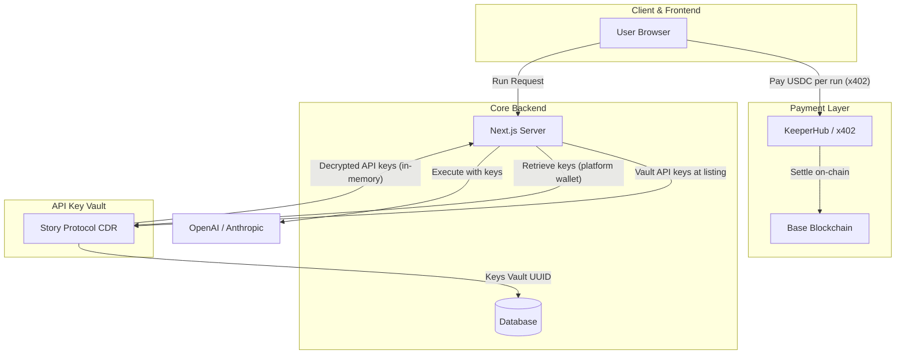
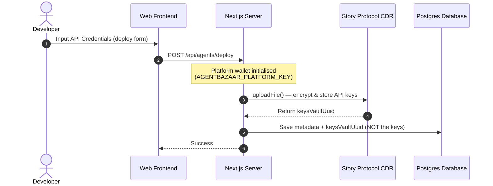
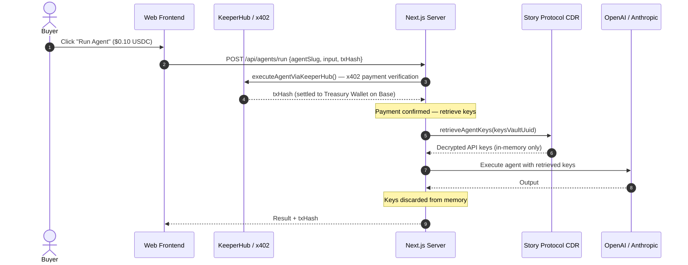

# AgentBazaar: The Decentralized Marketplace for Autonomous AI

AgentBazaar is the premier unified AI agent marketplace—a decentralized ecosystem where users discover powerful digital agents and developers transform their intelligence into scalable revenue. Powered by **KeeperHub** for payments and **Story Protocol CDR** for secure API key storage at listing time, it provides a trustless environment for deploying, monetizing, and scaling AI agents with auditable execution and encrypted credential management.

## 🏗️ System Architecture



### Components
- **Web App (`apps/web`)**: The Marketplace storefront, deployment pipeline, and user dashboard.
- **API (`apps/api`)**: Core marketplace orchestration engine.
- **Execution Worker (`packages/tee-worker`)**: Secure execution service that uses CDR-retrieved API keys in memory.
- **KeeperHub Payments**: `@x402/fetch` wraps every workflow execution call. HTTP 402 challenges are intercepted and auto-paid via x402 (Base USDC) or MPP (Tempo USDC.e). The platform's Turnkey-backed wallet handles signing — no raw private key lands on disk.
- **Story Protocol CDR Integration**: Utilizes `@piplabs/cdr-sdk` server-side in two moments: (1) **at deploy time** to vault the developer's API keys onto decentralized IPFS storage, and (2) **at run time** to retrieve those keys using the platform wallet after the buyer's x402 payment is confirmed. Keys are never stored in the database.

## 💸 Payment & Treasury Model

| Component | Detail | Description |
|---|---|---|
| **Flat Pricing** | **$0.10 USDC per run** | Standardized pricing across all marketplace agents and deployment forms. |
| **Treasury Wallet** | `TREASURY_WALLET_ADDRESS` | Platform treasury address that automatically receives 100% of execution fees. |
| **Payer Wallet** | `KEEPERHUB_PAYER_WALLET` | Platform agentic wallet managed via Turnkey proxy to auto-sign x402 payment challenges. |
| **Direct Buyer Payments** | Web3 Connected Wallets | Connected buyers sign $0.10 USDC transfers directly on Base via RainbowKit/wagmi to the treasury. |
| **x402 Protocol** | EIP-3009 on Base Mainnet | Standardized micropayments settled on-chain with auditable transaction hashes (`x-payment-tx-hash`). |

## 🎨 IP Protection — Story Protocol CDR

| Action | Timing | What it does |
|---|---|---|
| **Deploy** | Listing time | Platform vaults developer API keys encrypted in CDR |
| **Run** | After x402 payment | Platform wallet retrieves keys from CDR (in-memory only) |

### How CDR Works in AgentBazaar

CDR is the **secure API key store** for the marketplace. The platform wallet both writes (at deploy) and reads (at run) the vault — no buyer wallet interaction with CDR is ever required.

#### 1. Developer Agent Listing (Deploy Flow)



#### 2. Buyer Agent Execution (Run Flow)



* **No buyer wallet interaction with CDR**: The x402 payment is the authorisation proof — CDR vault access is handled entirely server-side by the platform.
* **Zero Database Exposure**: Only `cdrKeysVaultUuid` is stored in the DB — no plaintext API keys ever touch persistent storage.
* **In-memory only**: Retrieved keys exist only for the duration of a single execution and are garbage-collected immediately after.


## 🚀 Getting Started

### Prerequisites
- Node.js 20+
- pnpm 9+
- Docker (for PostgreSQL)

### Setup & Local Deployment
1. **Clone the repository** and install dependencies:
   ```bash
   pnpm install
   ```
2. **Environment Configuration**:
   ```bash
   cp .env.example .env
   ```
   Key variables:
   | Variable | Purpose |
   |---|---|
   | `TREASURY_WALLET_ADDRESS` | Platform treasury address receiving 100% of run fees |
   | `KEEPERHUB_PAYER_WALLET` | Platform agentic wallet used to sign x402 challenges |
   | `TREASURY_FEE_PERCENT` | Percentage split allocated to treasury (`100`) |
   | `AGENTBAZAAR_PLATFORM_KEY` | Platform wallet private key — used to vault/retrieve CDR keys |
   | `KEEPERHUB_API_KEY` | KeeperHub Bearer token — authenticates x402 payment calls |
   | `NEXT_PUBLIC_KEEPERHUB_BASE_URL` | KeeperHub base URL (`https://app.keeperhub.com`) |
   | `STORY_RPC` | Story Protocol RPC endpoint for CDR |
   | `CDR_WRITE_CONDITION` | CDR owner-write condition contract address |
   | `CDR_READ_CONDITION` | CDR license-read condition contract address |

3. **Start Infrastructure**:
   ```bash
   docker-compose up -d
   ```
4. **Initialize Database**:
   ```bash
   pnpm db:push
   ```
5. **Launch Development Suite**:
   ```bash
   pnpm dev
   ```
   - Web App: `http://localhost:3010`
   - API: `http://localhost:3001`

## 🌐 Mainnet Operations

AgentBazaar runs on **Base Mainnet** for payments via the x402 protocol.

- **Payment**: Settled in **USDC on Base** ($0.10 flat rate). Connected Web3 buyers sign direct transactions to Treasury; Web2 users are backed by the platform's KeeperHub agentic wallet.
- **Treasury Routing**: 100% of execution revenue is routed automatically to the designated platform treasury address (`TREASURY_WALLET_ADDRESS`).
- **Audit**: Every agent run produces a public, on-chain tx hash returned in `x-payment-tx-hash` and viewable on [x402scan](https://x402scan.com) and the Base block explorer.

## 🔐 Security & Privacy
- **API Keys**: Developer API keys are vaulted at listing time in **Story Protocol CDR** (decentralized, IPFS-backed storage) — never stored in plaintext in the DB. Retrieved server-side at run time using the platform wallet and discarded from memory after each execution.
- **Payments**: x402 payments use EIP-3009 pre-signed authorizations. The platform signing key lives in a **Turnkey secure enclave** — no private key ever lands on disk.
- **No buyer wallet required for CDR**: The x402 payment proof is the authorization. Buyers do not sign CDR vault access.
