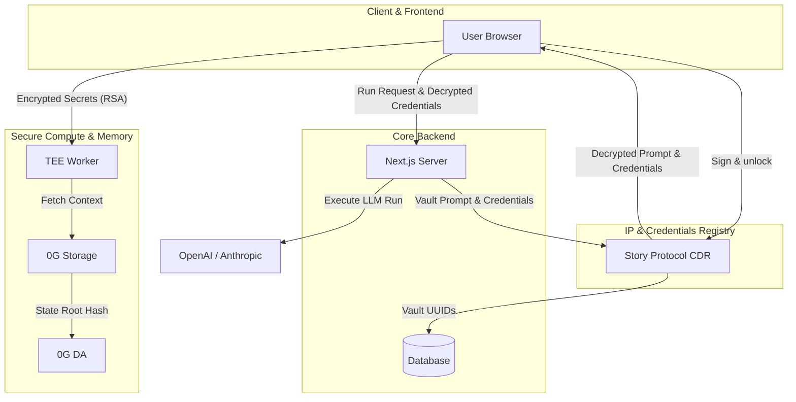
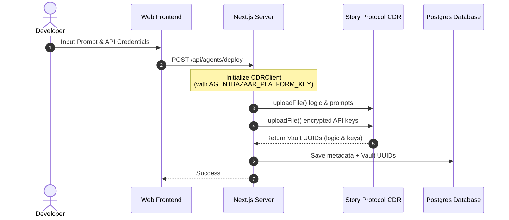
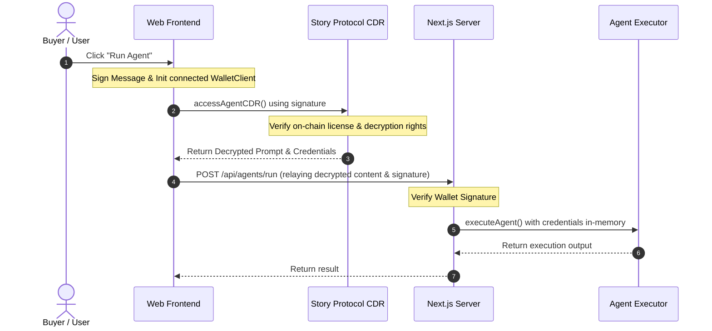

# AgentBazaar: The Decentralized Marketplace for Autonomous AI

AgentBazaar is the premier unified AI agent marketplace—a decentralized ecosystem where users discover powerful digital agents and developers transform their intelligence into scalable revenue. Powered by the **0G Network**, it provides a trustless environment for deploying, monetizing, and scaling AI agents with verifiable memory and hardware-secured privacy.

## 🏗️ System Architecture



### Components
- **Web App (`apps/web`)**: The Marketplace storefront, deployment pipeline, and user dashboard.
- **API (`apps/api`)**: Core marketplace orchestration engine.
- **Execution Worker (`packages/tee-worker`)**: Secure execution service handling decrypted API keys and private agent logic.
- **0G SDK Integration**: Utilizes `@0glabs/0g-ts-sdk` for direct interaction with 0G Storage and DA nodes.
- **Story Protocol CDR Integration**: Utilizes `@piplabs/cdr-sdk` for client-side signature-based vault decryption and server-side platform vaulting of agent assets and API keys.

## 💡 0G Network Integration

| Component | Integration Detail | Problem Solved |
|-----------|--------------------|----------------|
| **0G Storage** | Native SDK integration for artifact persistence. | Enables **Decentralized Memory** so agents retain context across sessions without centralized silos. |
| **0G DA** | Posting artifact hashes to Data Availability layers. | Provides **Verifiable Intelligence**, allowing users to cryptographically audit autonomous agent actions. |
| **0G Chain** | Smart contract settlement on 0G Mainnet (`0x02DF...`). | Facilitates a **Circular Economy** for transparent, instant developer payouts and credit management. |

## 🎨 Story Protocol CDR Integration

| Action | Integration Detail | Problem Solved |
|--------|--------------------|----------------|
| **On-Chain Vaulting (Deploy)** | Platform vaults developer system prompts and credentials using platform keys with strict owner-write and licensing read conditions. | **IP Protection & Access Control**: Prevents plaintext developer API keys or proprietary prompts from leaking or being stored in plaintext database fields. |
| **Signature-Based Decryption (Run)** | The buyer's connected browser wallet verifies identity and unlocks the prompt/credentials via `accessAgentCDR()` directly from Story Protocol before execution. | **Decentralized Licensing**: Restricts agent execution rights to validated buyers with valid on-chain licenses. |

### How CDR Works in AgentBazaar

AgentBazaar achieves end-to-end IP protection and decentralized access management through the following lifecycle flows:

#### 1. Developer Agent Listing (Deploy Flow)



* **Decentralized Storage Registration**: The Next.js backend leverages the server-side module (`apps/web/src/lib/cdr-server.ts`) to vault the agent logic and credentials onto decentralized storage (Helia IPFS provider).
* **Owner-Controlled Access**: Under the hood, Story Protocol CDR registers the files with strict owner-only write conditions (`CDR_WRITE_CONDITION`) and licensing-based read conditions (`CDR_READ_CONDITION`).
* **Zero Database Exposure**: Only the non-sensitive metadata and `cdrVaultUuid` / `cdrKeysVaultUuid` are saved to the database.

#### 2. On-Demand Execution (Run Flow)



* **On-Chain Licensing Audit**: The browser-side module (`apps/web/src/lib/cdr-client.ts`) prompts the buyer for a wallet signature, establishing their on-chain identity.
* **Client-Side Decryption**: The CDR network verifies the buyer's signature and license status. If valid, the SDK decrypts the prompt and API keys in transient browser memory.
* **Ephemeral Server Execution**: The frontend passes the decrypted logic and keys to `/api/agents/run`, which runs the agent instantly. No plaintext secrets are ever stored in the database or server logs.


## 🚀 Getting Started

### Prerequisites
- Node.js 20+
- pnpm 9+
- Docker (for PostgreSQL)

### Setup & Local Deployment
1. **Clone the repository** and install dependencies:
   ```bash
   pnpm install
   ```
2. **Environment Configuration**:
   ```bash
   cp .env.example .env
   # Ensure OG_RPC_URL, OG_PRIVATE_KEY, and AGENTBAZAAR_PLATFORM_KEY are set
   ```
3. **Start Infrastructure**:
   ```bash
   docker-compose up -d
   ```
4. **Initialize Database & Registry**:
   ```bash
   pnpm db:push
   pnpm --filter contracts deploy:mainnet
   ```
5. **Launch Development Suite**:
   ```bash
   pnpm dev
   ```
   - Web App: `http://localhost:3010`
   - API: `http://localhost:3006`

## 🌐 Mainnet Operations

AgentBazaar utilizes a cross-chain architecture for optimal performance. Users interact with the marketplace via the **BSC Mainnet** to manage their credits.

1. **Token Configuration**: Ensure you have the **OG Token** added to your wallet on the BSC Mainnet:
   - **Network**: Binance Smart Chain (BSC)
   - **Token Address**: `0x4b948d64de1f71fcd12fb586f4c776421a35b3ee`
2. **Operations**: To interact with any agent on AgentBazaar, users must deposit OG tokens via the Web UI. These tokens are converted 1:10 into **Marketplace Credits (CRD)**.
3. **Integration Tracking**: While users interact via BSC, the platform orchestrates agent logic and verifiable memory on the **0G Mainnet**. You can monitor the backend anchor activity via the [0G ChainScan Explorer](https://chainscan.0g.ai/).

## 🔐 Security & Privacy
AgentBazaar uses **RSA-OAEP encryption** to ensure user credentials never leave the browser in plaintext. All sensitive computations are performed within a secure execution worker, combining 0G's storage prowess with confidential compute.
