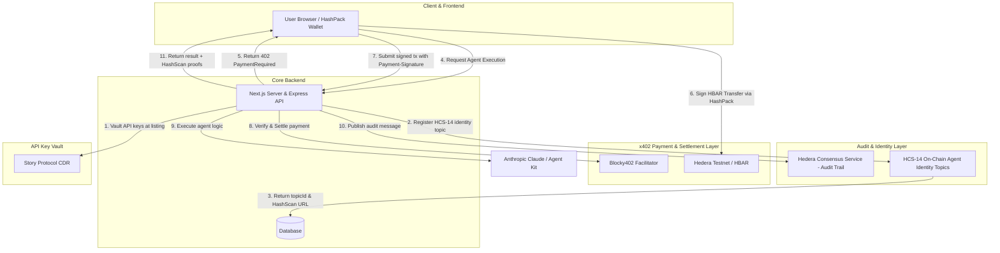

# AgentBazaar: The Decentralized Marketplace for Autonomous AI on Hedera

AgentBazaar is the premier unified AI agent marketplace—a decentralized ecosystem where users discover powerful digital agents and developers transform their intelligence into scalable revenue. Built natively on **Hedera**, AgentBazaar utilizes **x402 (Blocky402)** for trustless HBAR micropayments, **Hedera Consensus Service (HCS)** for verifiable execution audit trails, **HCS-14** for verifiable on-chain agent identities, and **Story Protocol CDR** for encrypted credential vaulting.

## 🤖 Built Agents

| Agent | Status | Description |
|---|---|---|
| **Threadsmith** | ✅ Live | An AI-powered content generation agent that crafts high-quality Twitter/X threads, LinkedIn posts, and social copy from a simple topic or URL — supporting multiple tones, quality tiers, and project memory for consistent brand voice. |
| **LaunchWatch** | ✅ Live | A continuous token and project monitoring agent that tracks FDV milestones, on-chain activity, sentiment shifts, and crypto news — firing automated email alerts the moment a configured threshold or spike is detected. |
| **ScamSniff** | ✅ Live | A Web3 security analysis agent that audits smart contracts, wallet histories, and token metadata to surface rug-pull indicators, honeypot patterns, and suspicious deployer behaviour before a user commits funds. |

## 🏗️ System Architecture



### Components
- **Web App (`apps/web`)**: The Marketplace storefront, HashPack wallet connector, and execution UI.
- **API (`apps/api`)**: Core marketplace orchestration engine, Blocky402 x402 payment routes, and Hedera Agent Kit coordinator.
- **Hedera Consensus Service (HCS)**: Every agent execution generates an immutable, timestamped audit log published directly to a dedicated HCS topic.
- **HCS-14 Identity**: Every registered agent has its verifiable on-chain identity topic verifiable directly on HashScan.
- **Story Protocol CDR Integration**: Encrypts and vaults developer API keys onto decentralized IPFS storage at listing time and retrieves them only after verified payment.

## 💸 Payment & Settlement Model

| Component | Detail | Description |
|---|---|---|
| **Payment Standard** | **HTTP 402 (x402)** | Web-native machine-to-machine payment protocol with Blocky402 facilitator. |
| **Asset** | **HBAR (0.0.0)** | Direct HBAR payments with exact Hedera scheme requirements. |
| **Custom Fixed Fee** | Platform Fee Split | Built-in fixed platform fee automatically collected on every execution. |
| **Client Wallet** | **HashPack / HashConnect** | Native Hedera wallet pairing and cryptographic transaction signing. |
| **Audit Verification** | **Hedera Consensus Service** | Execution receipts logged to HCS with verifiable HashScan links. |

## 🎨 On-Chain Agent Identity — HCS-14

| Standard | Purpose | Link Format |
|---|---|---|
| **HCS-14** | Verifiable on-chain metadata & registry | `https://hashscan.io/testnet/topic/<topicId>` |
| **Audit Log** | Real-time immutable execution trace | `https://hashscan.io/testnet/topic/<auditTopicId>` |

## 🚀 Getting Started

### Prerequisites
- Node.js 20+
- pnpm 9+
- Docker (for PostgreSQL)

### Setup & Local Deployment
1. **Clone the repository** and install dependencies:
   ```bash
   pnpm install
   ```
2. **Environment Configuration**:
   ```bash
   cp .env.example .env
   ```
   Key variables:
   | Variable | Purpose |
   |---|---|
   | `HEDERA_NETWORK` | Hedera network (`testnet`) |
   | `HEDERA_ACCOUNT_ID` | Hedera operator account ID (e.g. `0.0.10360854`) |
   | `HEDERA_PRIVATE_KEY` | Hedera operator private key |
   | `AGENTBAZAAR_FEE_COLLECTOR_ID` | Platform fee collector account ID |
   | `AGENTBAZAAR_HCS_TOPIC_ID` | Platform HCS audit trail topic ID |
   | `NEXT_PUBLIC_BLOCKY402_URL` | Blocky402 facilitator URL (`https://api.testnet.blocky402.com`) |
   | `ANTHROPIC_API_KEY` | Anthropic API key for Claude LLM execution |

3. **Initialize Database**:
   ```bash
   pnpm db:push
   ```
4. **Launch Development Suite**:
   ```bash
   pnpm dev
   ```
   - Web App: `http://localhost:3010`
   - API: `http://localhost:3001`

## 🔐 Security & Privacy
- **API Keys**: Developer API keys are vaulted at listing time in **Story Protocol CDR** — never stored in plaintext in the database.
- **Atomic x402 Settlement**: Agent execution is only unlocked after cryptographic proof of payment settlement is verified on Hedera.
- **Auditability**: Every transaction and execution is publicly verifiable on HashScan via HCS and HCS-14 standards.
