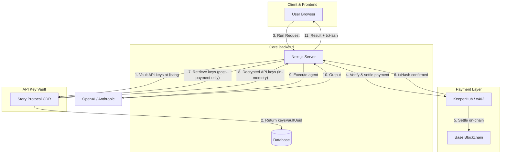
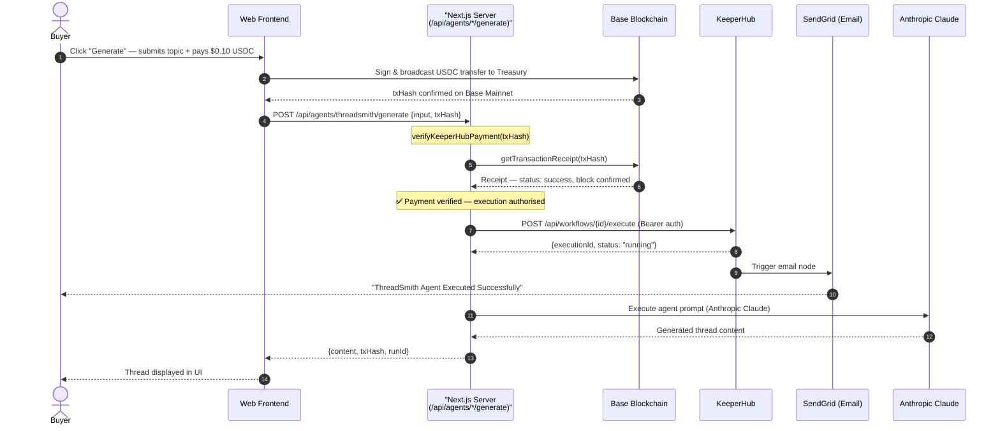
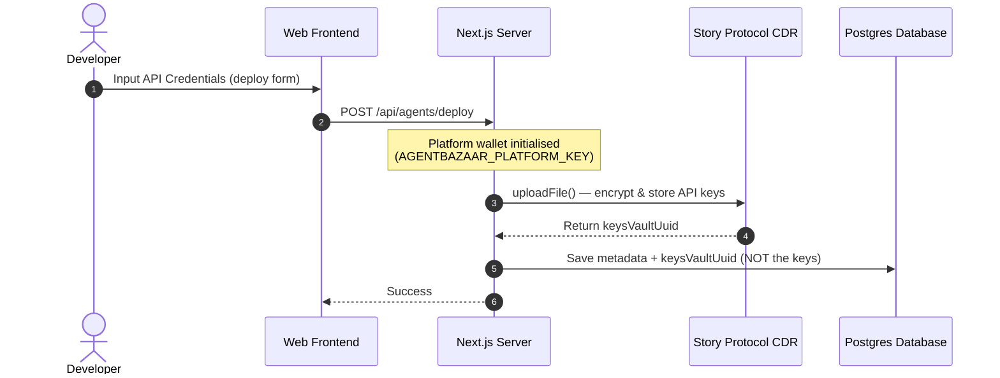

# AgentBazaar: The Decentralized Marketplace for Autonomous AI

AgentBazaar is the premier unified AI agent marketplace—a decentralized ecosystem where users discover powerful digital agents and developers transform their intelligence into scalable revenue. Powered by **KeeperHub** for workflow orchestration and email notifications, **Base USDC** for on-chain payment verification, and **Story Protocol CDR** for secure API key storage at listing time, it provides a trustless environment for deploying, monetizing, and scaling AI agents with auditable execution and encrypted credential management.

## 🤖 Built Agents

| Agent | Status | Description |
|---|---|---|
| **Threadsmith** | ✅ Live | An AI-powered content generation agent that crafts high-quality Twitter/X threads, LinkedIn posts, and social copy from a simple topic or URL — supporting multiple tones, quality tiers, and project memory for consistent brand voice. |
| **LaunchWatch** | ✅ Live | A continuous token and project monitoring agent that tracks FDV milestones, on-chain activity, sentiment shifts, and crypto news — firing automated email alerts the moment a configured threshold or spike is detected. |
| **ScamSniff** | 🚧 In Development | A Web3 security analysis agent that audits smart contracts, wallet histories, and token metadata to surface rug-pull indicators, honeypot patterns, and suspicious deployer behaviour before a user commits funds. |

## 🏗️ System Architecture



### Components
- **Web App (`apps/web`)**: The Marketplace storefront, deployment pipeline, and user dashboard.
- **API (`apps/api`)**: Core marketplace orchestration engine.
- **Execution Worker (`packages/tee-worker`)**: Secure execution service that uses CDR-retrieved API keys in memory.
- **KeeperHub Workflow Engine**: Each agent (ThreadSmith, LaunchWatch) has a registered workflow on KeeperHub. On every paid run, `executeAgentViaKeeperHub()` dispatches `POST /api/workflows/{id}/execute` using a Bearer API key. KeeperHub logs the run on its dashboard and triggers a **SendGrid email notification** to the platform owner. The workflow ID is resolved from the `KEEPERHUB_WORKFLOW_ID_<AGENT>` env var (no slug-based lookup overhead).
- **Story Protocol CDR Integration**: Utilizes `@piplabs/cdr-sdk` server-side in two moments: (1) **at deploy time** to vault the developer's API keys onto decentralized IPFS storage, and (2) **at run time** to retrieve those keys using the platform wallet after the buyer's payment is confirmed. Keys are never stored in the database.

## 💸 Payment & Treasury Model

| Component | Detail | Description |
|---|---|---|
| **Flat Pricing** | **$0.10 USDC per run** | Standardized pricing across all marketplace agents and deployment forms. |
| **Treasury Wallet** | `TREASURY_WALLET_ADDRESS` | Platform treasury address that automatically receives 100% of execution fees. |
| **Payer Wallet** | `KEEPERHUB_PAYER_WALLET` | Platform agentic wallet managed via Turnkey proxy to auto-sign x402 payment challenges. |
| **Direct Buyer Payments** | Web3 Connected Wallets | Connected buyers sign $0.10 USDC transfers directly on Base via RainbowKit/wagmi to the treasury. |
| **x402 Protocol** | EIP-3009 on Base Mainnet | Standardized micropayments settled on-chain with auditable transaction hashes (`x-payment-tx-hash`). |

## 🎨 IP Protection — Story Protocol CDR

| Action | Timing | What it does |
|---|---|---|
| **Deploy** | Listing time | Platform vaults developer API keys encrypted in CDR |
| **Run** | After x402 payment | Platform wallet retrieves keys from CDR (in-memory only) |

### How KeeperHub Works in AgentBazaar

KeeperHub is the **workflow orchestration and notification layer**. Buyers pay directly via their connected Web3 wallet (Base USDC). The payment is verified on-chain by the server before KeeperHub is called. KeeperHub then logs the run on its dashboard and fires a **SendGrid email notification** confirming execution.

#### Role Summary

| Responsibility | Detail |
|---|---|
| **On-chain payment verification** | Server verifies the buyer's USDC `txHash` on Base Mainnet via `getTransactionReceipt` before any execution |
| **Workflow dispatch** | `POST /api/workflows/{id}/execute` called with Bearer auth — logs run on KeeperHub dashboard |
| **Email notification** | KeeperHub workflow triggers a **SendGrid email** to the platform owner on every confirmed execution |
| **Dashboard audit trail** | Every run appears in the KeeperHub dashboard with an `executionId` for monitoring and debugging |
| **Workflow ID resolution** | IDs resolved from `KEEPERHUB_WORKFLOW_ID_<AGENT>` env var — KeeperHub uses opaque IDs, not human slugs |

#### Payment & Execution Flow



#### 1. Developer Agent Listing (Deploy Flow)

> KeeperHub is **not involved** at deploy time. This step only vaults the developer's API keys into Story Protocol CDR for later retrieval.



#### Key Guarantees

* **Hard on-chain payment gate**: `verifyKeeperHubPayment(txHash)` queries Base Mainnet for the transaction receipt before any LLM execution. A reverted, missing, or wrong-contract tx throws immediately — no execution path bypasses it.
* **Web3-native buyer payments**: Buyers sign $0.10 USDC transfers directly from their connected wallet (RainbowKit/wagmi) to the treasury on Base Mainnet. No platform payer wallet is needed for buyer-side payments.
* **KeeperHub as audit + notification layer**: KeeperHub does not gate the payment — it receives the dispatch *after* on-chain verification and records the run on its dashboard + fires the SendGrid email notification.
* **Email on every run**: The KeeperHub workflow (Manual trigger → SendGrid action) sends a confirmation email to the platform owner for every successfully paid ThreadSmith or LaunchWatch execution.
* **Auditable by design**: Every run produces a public Base Mainnet `txHash` viewable on the Base block explorer and stored in the run record.
* **Zero Database Exposure**: Only `cdrKeysVaultUuid` is stored in the DB — no plaintext API keys ever touch persistent storage.
* **In-memory only**: Retrieved CDR keys exist solely for the duration of a single execution and are garbage-collected immediately after the LLM call completes.


## 🚀 Getting Started

### Prerequisites
- Node.js 20+
- pnpm 9+
- Docker (for PostgreSQL)

### Setup & Local Deployment
1. **Clone the repository** and install dependencies:
   ```bash
   pnpm install
   ```
2. **Environment Configuration**:
   ```bash
   cp .env.example .env
   ```
   Key variables:
   | Variable | Purpose |
   |---|---|
   | `TREASURY_WALLET_ADDRESS` | Platform treasury address receiving 100% of run fees on Base Mainnet |
   | `TREASURY_FEE_PERCENT` | Percentage split allocated to treasury (`100`) |
   | `AGENTBAZAAR_PLATFORM_KEY` | Platform wallet private key — used to vault/retrieve CDR keys |
   | `KEEPERHUB_API_KEY` | KeeperHub Bearer token — authenticates workflow dispatch calls |
   | `NEXT_PUBLIC_KEEPERHUB_BASE_URL` | KeeperHub base URL (`https://app.keeperhub.com`) |
   | `KEEPERHUB_WORKFLOW_ID_THREADSMITH` | KeeperHub opaque workflow ID for ThreadSmith (e.g. `glj0xzuvyi01z732m8cs3`) |
   | `KEEPERHUB_WORKFLOW_ID_LAUNCHWATCH` | KeeperHub opaque workflow ID for LaunchWatch (e.g. `9di1q9c0twztsvnd6973t`) |
   | `KEEPER_WEBHOOK_SECRET` | Shared secret for authenticating inbound KeeperHub webhook calls |
   | `ANTHROPIC_API_KEY` | Anthropic API key for Claude LLM execution (ThreadSmith, etc.) |
   | `RESEND_API_KEY` | Resend API key for platform transactional emails |
   | `CDR_WRITE_CONDITION` | CDR owner-write condition contract address |
   | `CDR_READ_CONDITION` | CDR license-read condition contract address |

   > **KeeperHub Workflow IDs**: KeeperHub uses opaque database IDs (not human slugs) in its REST API. Retrieve them by calling `GET https://app.keeperhub.com/api/workflows` with your Bearer token and noting the `id` field for each workflow. The `resolveWorkflowId()` function will auto-lookup by name if the env var is missing, but setting the env var is strongly recommended to avoid the extra HTTP round-trip.

3. **Start Infrastructure**:
   ```bash
   docker-compose up -d
   ```
4. **Initialize Database**:
   ```bash
   pnpm db:push
   ```
5. **Launch Development Suite**:
   ```bash
   pnpm dev
   ```
   - Web App: `http://localhost:3010`
   - API: `http://localhost:3001`

## 🌐 Mainnet Operations

AgentBazaar runs on **Base Mainnet** for on-chain USDC payments.

- **Payment**: Settled in **USDC on Base** ($0.10 flat rate). Buyers sign the transfer directly from their connected Web3 wallet (RainbowKit/wagmi) to `TREASURY_WALLET_ADDRESS`. The resulting `txHash` is passed to the server for on-chain verification.
- **Verification**: The server calls `getTransactionReceipt(txHash)` on Base Mainnet with RPC failover (mainnet.base.org → llamarpc → 1rpc → tenderly). Execution is only authorised once the receipt confirms `status: success` against the Base USDC contract.
- **KeeperHub Notification**: After payment verification, the server dispatches `POST /api/workflows/{id}/execute` to KeeperHub. KeeperHub logs the run on its dashboard and triggers a **SendGrid email notification** to the platform owner.
- **Treasury Routing**: 100% of execution revenue is routed automatically to the designated platform treasury address (`TREASURY_WALLET_ADDRESS`).
- **Audit**: Every agent run produces a public, on-chain `txHash` viewable on the [Base block explorer](https://basescan.org) and stored in the AgentBazaar run history.

## 🔐 Security & Privacy
- **API Keys**: Developer API keys are vaulted at listing time in **Story Protocol CDR** (decentralized, IPFS-backed storage) — never stored in plaintext in the DB. Retrieved server-side at run time using the platform wallet and discarded from memory after each execution.
- **Payments**: x402 payments use EIP-3009 pre-signed authorizations. The platform signing key lives in a **Turnkey secure enclave** — no private key ever lands on disk.
- **No buyer wallet required for CDR**: The x402 payment proof is the authorization. Buyers do not sign CDR vault access.
